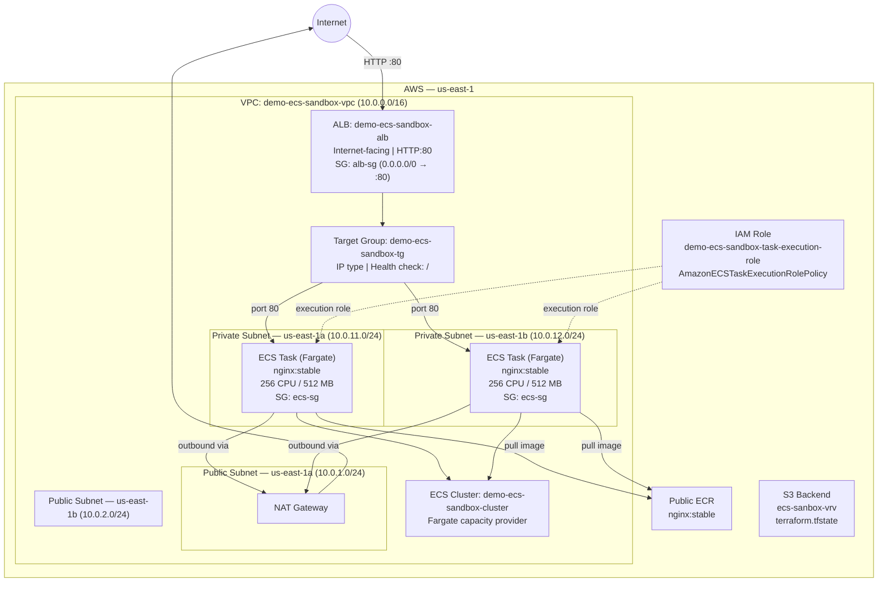
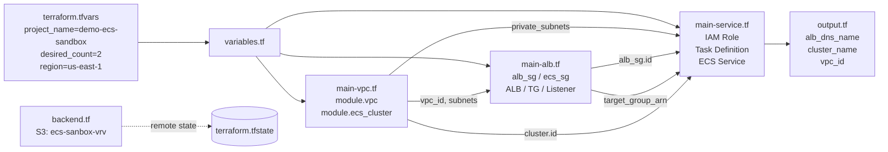

```mermaid
graph TB
    Internet((Internet))

    subgraph AWS["AWS — us-east-1"]

        subgraph VPC["VPC: demo-ecs-sandbox-vpc (10.0.0.0/16)"]

            subgraph PublicA["Public Subnet — us-east-1a (10.0.1.0/24)"]
                NATGW[NAT Gateway]
            end

            subgraph PublicB["Public Subnet — us-east-1b (10.0.2.0/24)"]
            end

            ALB["ALB: demo-ecs-sandbox-alb\nInternet-facing | HTTP:80\nSG: alb-sg (0.0.0.0/0 → :80)"]

            subgraph PrivateA["Private Subnet — us-east-1a (10.0.11.0/24)"]
                Task1["ECS Task (Fargate)\nnginx:stable\n256 CPU / 512 MB\nSG: ecs-sg"]
            end

            subgraph PrivateB["Private Subnet — us-east-1b (10.0.12.0/24)"]
                Task2["ECS Task (Fargate)\nnginx:stable\n256 CPU / 512 MB\nSG: ecs-sg"]
            end

            TG["Target Group: demo-ecs-sandbox-tg\nIP type | Health check: /"]
            Cluster["ECS Cluster: demo-ecs-sandbox-cluster\nFargate capacity provider"]
        end

        IAM["IAM Role\ndemo-ecs-sandbox-task-execution-role\nAmazonECSTaskExecutionRolePolicy"]
        ECR["Public ECR\nnginx:stable"]
        S3["S3 Backend\necs-sanbox-vrv\nterraform.tfstate"]
    end

    Internet -->|HTTP :80| ALB
    ALB --> TG
    TG -->|port 80| Task1
    TG -->|port 80| Task2
    Task1 & Task2 --> Cluster
    Task1 & Task2 -->|outbound via| NATGW
    NATGW --> Internet
    Task1 & Task2 -->|pull image| ECR
    IAM -.->|execution role| Task1 & Task2
```

## Resource Relationships

```mermaid
graph LR
    TFVars["terraform.tfvars\nproject_name=demo-ecs-sandbox\ndesired_count=2\nregion=us-east-1"] --> Variables["variables.tf"]
    Variables --> VPC["main-vpc.tf\nmodule.vpc\nmodule.ecs_cluster"]
    Variables --> ALB["main-alb.tf\nalb_sg / ecs_sg\nALB / TG / Listener"]
    Variables --> SVC["main-service.tf\nIAM Role\nTask Definition\nECS Service"]

    VPC -->|vpc_id, subnets| ALB
    VPC -->|private_subnets| SVC
    ALB -->|alb_sg.id| SVC
    ALB -->|target_group_arn| SVC
    VPC -->|cluster.id| SVC

    SVC --> Output["output.tf\nalb_dns_name\ncluster_name\nvpc_id"]

    Backend["backend.tf\nS3: ecs-sanbox-vrv"] -.->|remote state| TFState[("terraform.tfstate")]
```
